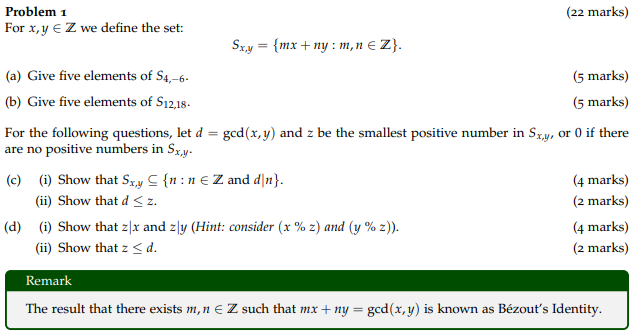

# Assignment 1

Sixiang Qiu

October 2021

## Problem 1

### (**a**)

$$
S{_4}{_,}{_-}{_6}=\{\ 4m-6y:m,n∈Z\ \}\\
$$

| Value of m, n | Elements of S |
| :-----------: | :-----------: |
| m = 1, n = 1  |      -2       |
| m = 2, n = 2  |      -4       |
| m = 3, n = 3  |      -6       |
| m = 4, n = 4  |      -8       |
| m = 5, n = 5  |      -10      |

### **(b)**

$$
S{_1}{_2}{_,}{_1}{_8}=\{\ 12m+18y:m,n∈Z\ \}\\
$$

| Value of m, n | Elements of S |
| :-----------: | :-----------: |
| m = 1, n = 1  |      30       |
| m = 2, n = 2  |      60       |
| m = 3, n = 3  |      90       |
| m = 4, n = 4  |      120      |
| m = 5, n = 5  |      150      |

### **(c)** 

#### **(i)** 

1. ​	Suppose *w* to be elements of *S*,
   $$
   S{_x}{_,}{_y}=\{\ mx+ny:m,n∈Z\ \}\\
   $$

2. ​	Then *w* can be expressed in the form as follow, where x, y are Integers.
   $$
   w=mx+ny\quad(m,n∈Z)
   $$

3. ​	Since $d\ =\ gcd\ (\ x,\ y\ )$, then $d\ |\ x$ and $d\ |\ y$,

4. ​	Since m, n are Integers, then $\ d\ |\ mx$ and $d\ |\ ny$,

5. ​	Clearly, $d\ |\ (\ mx\ +\ ny\ )$, that is $d\ |\ w$,

6. ​	Clearly, 
   $$
   \ \ \ \ w\ ∈\{\ n:n∈Z\ and\ d\ |\ n\ \}
   $$

7. ​	Then, 
   $$
   S{_x}{_,}{_y}⊆\{\ n:n∈Z\ and\ d\ |\ n\ \}
   $$

#### **(ii)**

1. ​	In the definition of greatest common divisor, 

   ​    we have $d\ ≥\ 0\ (\ d\ =\ 0\ for\ x\ =\ y\ =\ 0\ )$.

2. ​	· From question **(c) (i)**, we have *d* | *w* (*w* stands for elements in set *S*)

   ​    · Clearly, *z* is one of the elements in set *S*

   ​	Therefore, $d\ |\ z$.

3. ​	Since *z* is positive (*z* = 0 if there are no positive element in set *S*) and $d\ |\ z$,

   ​    Therefore, $z\ =\ Cd\ (\ where\ C\ is\ a\ positive\ Integer\ )$.

   ​    Therefore, $z\ ≥\ d\ (\ z\ =\ d\ for\ x\ =\ y\ =\ 0\ )$.

### **(d)**

#### **(i)**

1. ​	To prove this question, here refers to definition from Lecture material as follow.

   

2. ​	To prove this question, here starts from x since the procedure is the same for those of y.

   ​	 From definition 1 and 2, x could be described as following format:
   $$
   x\ \%\ z\ =\ x\  -\ \lfloor\frac{x}{z}\rfloor\ ·\ z
   $$

3. ​	Since *z* is one of the element of set *S*, we have:
   $$
   \ \ \ z\ =\ m{_1}x\ +\ n{_1}y\\\\
   $$
   ​	Substitute equation (7) with equation (8), we have:
   $$
   x\ \%\ z\ =\ x\ -\ \lfloor\frac{x}{z}\rfloor\ (\ m{_1}x\ +\ n{_1}y\ )\ \ \ \\
   \ \ \ \ \ \ \ \ \ \ \ \ \ \ \ \ \ \ \ \ =(1\ -\ \lfloor\frac{x}{z}\rfloor\ m{_1})\ x\ +\ (-\lfloor\frac{x}{z}\rfloor n{_1})\ y\\\downarrow\\
   \ \ \ \ \ \ \ \ \ \ \ \ \ \ x\ \%\ z\ =\ m{_2}x\ +\ n{_2}y\ (\ where\ m{_2},\ n{_2}\ ∈\ Z\ )
   $$
   ​	Therefore, $x\ \%\ z$ is also one of the element of set *S*.
   
4. ​	

   ​	From the definition above, we have:
   $$
   x\ \%\ z\ ∈\ [\ 0,\ z\ )
   $$

5. ​	Since *z* is the smallest positive number in set *S*, 
   $$
   x\ \%\ z\ =\ 0\ \ \ \ \ \ \ \ \ \
   $$

6. ​	Therefore, $z\ |\ x$, vice versa for proof of $z\ |\ y$.

#### **(ii)**

1. ​	From question **(d) (i)**, we have :

   ​	· $x\ \%\ z\ =\ 0$

   ​	· $y\ \%\ z\ =\ 0$,

   ​	Therefore, *z* is one of the common divisor of x, y.

2. ​	Since *d* is the greatest common divisor of x, y.

   ​	Therefore, $z ≤ d$.

## Problem 2

### **(a)**

1. 

   ​	Clearly, *w* is an Integer, which satisfies Bézout’s Identity,

   ​	Substitute *m* with *w*, we have: 
   $$
   wx\ +\ ny\ =\ gcd\ (\ x,\ y\ )\ =\ 1\\
   \downarrow\\
   wx\ +\ ny\ =\ 1\\
   \downarrow\\ 
   \ \ \ \ \ \ \ wx\ -\ 1\ =\ (-n)\ y
   $$
   ​	Therefore, $y\ |\ (\ wx\ -\ 1\ )$.

2. ​	

   ​	From definition 3, we have:
   $$
   wx\ =\ {_(}{_y}{_)}1
   $$

### (b)

1. 

   ​	From Fact, we have:
   $$
   gcd\ (\ x,\ y\ )\ ·\ lcm\ (\ x,\ y\ )\ =\ |\ x\ |\ ·\ |\ y\ |\\
   \downarrow\\
   lcm\ (\ x,\ y\ )\ =\ |\ x\ |\ ·\ |\ y\ |
   $$

2. ​	Clearly, x could not be the multiples of y.

   ​	Otherwise, the result of $lcm\ (x,\ y)$ would be $|x|$ but $|x|·|y|$.

3. ​	However, $\ y\ |\ kx$.

   ​	Therefore, $y\ |\ k$.

### (c)

1. ​	From Bézout’s Identity, suppose there exists a pair of *w* which:
   $$
   w{_1}x\ +\ n{_1}y\ =\ gcd\ (\ x,\ y\ )\ =\ 1\\
   w{_2}x\ +\ n{_2}y\ =\ gcd\ (\ x,\ y\ )\ =\ 1\\
   \downarrow\\
   (\ w{_1}\ -\ w{_2}\ )\ x\ =\ (\ n{_2}\ -\ n{_1}\ )\ y\\
   \downarrow\\
   y\ |\ (\ w{_1}\ -\ w{_2}\ )\ x
   $$

2. ​	From question **(b)**, which, $if\ gcd\ (\ x,\ y\ )\ =\ 1\ and\ y\ |\ kx\ then\ y\ |\ k$:
   $$
   y\ |\ (\ w{_1}\ -\ w{_2}\ )\ \ \
   $$

3. ​	Since:
   $$
   w{_1}\ ∈\ [\ 0,\ y\ )\\
   w{_2}\ ∈\ [\ 0,\ y\ )\\
   \downarrow\\
   -\ y\ <\ w{_1}\ -\ w{_2}\ <\ y
   $$

4. ​	Statement in Line 3 contradicts the Statement in Line 2.

   ​	Therefore, there is at most one *w*.

## Problem 4

### (a)

|       |                |                        |
| ----- | :------------- | :--------------------- |
| A ∩ ∅ | = A ∩ (A ∩ Aᶜ) | (Complement with ∩)    |
|       | = (A ∩ Aᶜ) ∩ A | (Commutatitivity of ∩) |
|       | = (Aᶜ ∩ A) ∩ A | (Commutatitivity of ∩) |
|       | = Aᶜ ∩ (A ∩ A) | (Associativity of ∩)   |
|       | = Aᶜ ∩ A       | (Idempotence of ∩)     |
|       | = A ∩ Aᶜ       | (Commutatitivity of ∩) |
|       | = ∅            | (Complement with ∩)    |

### (b)

|                    |                       |                              |
| ------------------ | --------------------- | ---------------------------- |
| (A \ Cᶜ) ∪ (B ∩ C) | = (A ∩ Cᶜᶜ) ∪ (B ∩ C) | (Definition of \\)           |
|                    | = (A ∩ C) ∪ (B ∩ C)   | (Double complement)          |
|                    | = (C ∩ A) ∪ (B ∩ C)   | (Commutatitivity of ∩)       |
|                    | = (C ∩ A) ∪ (C ∩ B)   | (Commutatitivity of ∩)       |
|                    | = C ∩ (A ∪ B)         | (Distributivity of ∩ over ∪) |
|                    | = C ∩ (B ∪ A)         | (Commutatitivity of ∪)       |

### (c)

|        |                         |                        |
| ------ | ----------------------- | ---------------------- |
| Aᶜ ⊕ 𝓤 | = (Aᶜ ∩ 𝓤ᶜ) ∪ (Aᶜᶜ ∩ 𝓤) | (Definition of ⊕)      |
|        | = (Aᶜ ∩ 𝓤ᶜ) ∪ (A ∩ 𝓤)   | (Double complement)    |
|        | = (Aᶜ ∩ 𝓤ᶜ) ∪ A         | (Identity of ∩)        |
|        | = ((Aᶜ ∩ 𝓤) ∩ 𝓤ᶜ) ∪ A   | (Identity of ∩)        |
|        | = (Aᶜ ∩ (𝓤 ∩ 𝓤ᶜ)) ∪ A   | (Associativity of ∩)   |
|        | = (Aᶜ ∩ ∅) ∪ A          | (Complement with ∩)    |
|        | = (Aᶜ ∩ (A ∩ Aᶜ)) ∪ A   | (Complement with ∩)    |
|        | = ((A ∩ Aᶜ) ∩ Aᶜ) ∪ A   | (Commutatitivity of ∩) |
|        | = (A ∩ (Aᶜ ∩ Aᶜ)) ∪ A   | (Associativity of ∩)   |
|        | = (A ∩ Aᶜ) ∪ A          | (Idempotence of ∩)     |
|        | = ∅ ∪ A                 | (Complement with ∩)    |
|        | = A ∪ ∅                 | (Commutatitivity of ∪) |
|        | = A                     | (Identity of ∪)        |

## Problem 5

### (a)

1. ​	Suppose $X = \{\ 001\ \}\ while\ Y = \{\ 0,\ 1\ \}$:
   $$
   X\ ∩\ Y\ =\ \{\ λ\ \}\\
   \downarrow\\
   (\ X\ ∩\ Y\ ){^*}\ =\ \{\ λ\ \}\ \ \ \ \ \ \
   $$

2. ​	Clearly, $X = \{\ 001\ \}$ is one of the element of $Y{^3}$.

3. ​	Therefore, $\{\ 001\ \}\ ∈\ X{^*}\ ∩\ Y{^*}$.

4. ​	Therefore, $(\ X\ ∩\ Y\ ){^*}\ ≠\ X{^*}\ ∩\ Y{^*}$, equation in question **(a)** disproved.

### (b)

1. ​	Suppose $X\ =\ \{\ 0\ \}\ while\ Y\ =\ \{\ 1\ \}$:
   $$
   XY\ =\ \{\ 01\ \}\\
   YX\ =\ \{\ 10\ \}\\
   \downarrow\\
   (\ XY\ ){^*}\ =\ \{λ,\ \ 01,\ 0101,\ 010101,\ ...\ \}
   $$

2. ​	Clearly, $YX\ ∉\ (\ XY\ ){^*}$

3. ​	Therefore, $(\ XY\ ){^*}\ ≠\ (\ YX\ ){^*}$, equation in question **(b)** disproved.

### (c)

1. ​	
   $$
   X\ (\ Y\ ∩\ Z)\ =\ \{\ xy:\ x\ ∈\ X\ and\ y\ ∈\ (\ Y\ ∩\ Z\ )\ \}
   $$

   $$
   (\ XY\ )\ ∩\ (\ XZ\ )\ =\ \{\ xy:\ x\ ∈\ X\ and\ y\ ∈\ Y\ \}\ ∩\\
   \ \ \ \ \ \ \ \ \ \ \ \ \ \ \ \ \ \ \ \ \ \ \ \ \ \ \ \ \ \ \ \ \ \{\ xy:\ x\ ∈\ X\ and\ y\ ∈\ Z\ \}
   $$

2. ​	Since the fore part of $XY$ is the same as those of $XZ$,

   ​	Their intersection is actually the intersection of their rear part,

   ​	Equation (21) can be written as:
   $$
   (\ XY\ )\ ∩\ (\ XZ\ )\ =\ \{\ xy:\ x\ ∈\ X\ and\ (\ y\ ∈\ Y\ and\ y\ ∈\ Z\ )\ \}
   $$
   ​	Therefore, $y\ ∈\ (\ Y ∩\ Z\ )$

3. ​	Therefore, $X\ (\ Y\ ∩\ Z)\ =\ (\ XY\ )\ ∩\ (\ XZ\ )$

## Problem 6

### (a)

| Functions |        Expressions         |
| :-------: | :------------------------: |
|     1     | $$f(a)=0\\f(b)=0\\f(c)=0$$ |
|     2     |  $f(a)=1\\f(b)=1\\f(c)=1$  |
|     3     |  $f(a)=0\\f(b)=0\\f(c)=1$  |
|     4     |  $f(a)=0\\f(b)=1\\f(c)=0$  |
|     5     |  $f(a)=0\\f(b)=1\\f(c)=1$  |
|     6     |  $f(a)=1\\f(b)=0\\f(c)=0$  |
|     7     |  $f(a)=1\\f(b)=1\\f(c)=0$  |
|     8     |  $f(a)=1\\f(b)=0\\f(c)=1$  |

### (b)

1. ​	

   ​	From Fact, we have:
   $$
   |\ Pow\ (\ \{\ a,\ b,\ c\ \}\ )\ |\ =\ 2{^|}{^\{}{^a}{^,}{^b}{^,}{^c}{^\}}{^|}\\
   \ \ \ \ \ \ \ \ \ \ \ \ \ \ \ \ \ \ \ \ \ \ \ \ \ \ \ \ \ \ \ \ \ \ =\ 2{^3}\ =\ 8
   $$

2. ​	Also, $|\ \{0,\ 1\}{^\{}{^a}{^,}{^b}{^,}{^c}{^\}}\ |\ =\ 8$.

3. ​	Therefore, the cardinality of answer for question (a) is equal to those of $Pow\ (\ \{\ a,\ b,\ c\ \}\ )$.

### (c)

1. ​	Suppose $\Sigma\ =\ \{\ 0,\ 1\ \}$​, then:
   $$
   |\ \{\ w\ ∈\ \{\ 0,\ 1\ \}{^*}\ :\ length\ (w)\ =\ 3\ \}\ |\\
   \downarrow\\
   |\ \{\ w\ ∈\ \Sigma{^*}\ :\ length\ (w)\ =\ 3\ \}\ |\\
   \downarrow\\
   |\ \Sigma{^3}\ |\ =\ |\ \Sigma\ |{^3}\ =\ 2{^3}\ =\ 8
   $$

2. ​	Also, $|\ \{0,\ 1\}{^\{}{^a}{^,}{^b}{^,}{^c}{^\}}\ |\ =\ 8$.

3. ​	Therefore, the cardinality of answer for question (a) is equal to those of $\{\ w\ ∈\ \{\ 0,\ 1\ \}{^*}\ :\ length\ (w)\ =\ 3\ \}$.

## Problem 8

### (a)

1. ​	For better flow of writing, syntax there is a *b*, is substituted with $\exists b$,

   ​	Therefore:
   $$
   R{_1};R{_2}\ =\ \{\ (a,c):there\ is\ a\ b\ with\ (a,b)∈R{_1}\ and\ (b,c)∈R{_2}\ \}\\
   \downarrow\\
   R{_1};R{_2}\ =\ \{\ (a,c):\exists b\ (\ (a,b)∈R{_1}\ \and\ (b,c)∈R{_2}\ )\ \}
   $$

2. ​	Suppose $<x,z>∈(R{_1};R{_2});R{_3}$:
   $$
   \exists y{_1}\ ((<x,y{_1}>∈(R{_1};R{_2}))\and (<y{_1},z>∈R{_3}))\\
   \Updownarrow\\
   \exists y{_1}\ ((\exists y{_2}(<x,y{_2}>∈R{_1})\and (<y{_2},y{_1}>∈R{_2}))\and (<y{_1},z>∈R{_3}))\\
   \Updownarrow\\
   \exists y{_1}\ \exists y{_2}\ (((<x,y{_2}>∈R{_1})\and (<y{_2},y{_1}>∈R{_2}))\and (<y{_1},z>∈R{_3}))\\
   \Updownarrow\\
   \exists y{_1}\ \exists y{_2}\ ((<x,y{_2}>∈R{_1})\and ((<y{_2},y{_1}>∈R{_2})\and (<y{_1},z>∈R{_3})))\\
   \Updownarrow\\
   \exists y{_2}\ ((<x,y{_2}>∈R{_1})\and \exists y{_1}\ ((<y{_2},y{_1}>∈R{_2})\and (<y{_1},z>∈R{_3})))\\
   \Updownarrow\\
   \exists y{_2}\ ((<x,y{_2}>∈R{_1})\and (<y{_2},z>∈(R{_2};R{_3})))\\
   \Updownarrow\\
   <x,z>∈R{_1};(R{_2};R{_3})
   $$

3. ​	Therefore, $(R{_1};R{_2});R{_3}\ =\ R{_1};(R{_2};R{_3})$.

### (b)

1. ​	Suppose $(x,z)∈I;R{_1}\ where\ I\ =\ \{(x,x):x∈S\}$:
   $$
   \exists y\ (\ ((x,y)∈I)\and ((y,z)∈R{_1})\ )\\
   \Downarrow\\
   \exists x\ (\ ((x,x)∈I)\and ((x,z)∈R{_1})\ )\\
   \Downarrow\\
   I;R{_1}\subseteq R{_1}
   $$

2. ​	Reversely, suppose $(x,z)∈R{_1}$​, then:
   $$
   (x,x)∈I\\
   \Downarrow\\
   (x,z)∈I;R{_1}\\
   \Downarrow\\
   R{_1}\subseteq I;R{_1}
   $$
   ​	Therefore, $I;R{_1}\ =\ R{_1}$.

3. ​	Suppose $(x,z)∈R{_1};I\ where\ I\ =\ \{(x,x):x∈S\}$:
   $$
   \exists y\ (\ ((x,y)∈R{_1})\and ((y,z)∈I)\ )\\
   \Downarrow\\
   \exists z\ (\ ((x,z)∈R{_1})\and ((z,z)∈I)\ )\\
   \Downarrow\\
   R{_1};I\subseteq R{_1}
   $$

4. ​	Reversely, suppose $(x,z)∈R{_1}$​, then:
   $$
   (z,z)∈I\\
   \Downarrow\\
   (x,z)∈R{_1};I\\
   \Downarrow\\
   R{_1}\subseteq R{_1};1
   $$
   ​	Therefore, $R{_1};1\ =\ R{_1}$.

5. ​	Therefore, $I;R{_1}\ =\ R{_1};I\ =\ R{_1}$.

### (c)

1. ​	Suppose $<x,z>∈(R{_1}∪R{_2});R{_3}$:
   $$
   \exists y\ ((<x,y>∈(R{_1}∪R{_2}))\and (<y,z>∈R{_3}))\\
   \Updownarrow\\
   \exists y\ ((<x,y>∈R{_1}\or <x,y>∈R{_2})\and (<y,z>∈R{_3}))\\
   \Updownarrow\\
   \exists y\ (((<x,y>∈R{_1})\and (<y,z>∈R{_3}))\or ((<x,y>∈R{_2})\and (<y,z>∈R{_3})))\\
   \Updownarrow\\
   \exists y\ ((<x,y>∈R{_1})\and (<y,z>∈R{_3}))\or \exists y\ ((<x,y>∈R{_2})\and (<y,z>∈R{_3}))\\
   \Updownarrow\\
   <x,z>∈R{_1};R{_3}\ \or <x,z>∈R{_2};R{_3}\\
   \Updownarrow\\
   <x,z>∈(R{_1};R{_3})∪(R{_2};R{_3})
   $$

2. ​	Therefore, $(R{_1}∪R{_2});R{_3}\ =\ (R{_1};R3)∪(R{_2};R{_3})$.

### (d)

1. ​	Suppose $<x,z>∈R{_1};(R{_2}∩R{_3})$:
   $$
   \exists y\ ((<x,y>∈R{_1})\and (<y,z>∈(R{_2}∩R{_3})))\\
   \Updownarrow\\
   \exists y\ ((<x,y>∈R{_1})\and ((<y,z>∈R{_2})\and (<y,z>∈R{_3})))\\
   \Downarrow\\
   \exists y\ ((<x,y>∈R{_1})\and (<y,z>∈R{_2}))\and \exists y\ ((<x,y>∈R{_1})\and (<y,z>∈R{_3}))\\
   \Updownarrow\\
   <x,z>∈R{_1};R{_2}\ \and <x,z>∈R{_1};R{_3}\\
   \Updownarrow\\
   <x,z>∈(R{_1};R{_2})∩(R{_1};R{_3})
   $$

2. ​	Since equation (32) includes an unfold of conjunction, the result should not be equal but inclusion.

   ​	Therefore, $R{_1};(R{_2}∩R{_3})\subseteq (R{_1};R{_2})∩(R{_1};R{_3})$.

3. ​	Equation in question (d) disproved.
