# Assignment 2

Sixiang Qiu

October 2021

## Problem 1

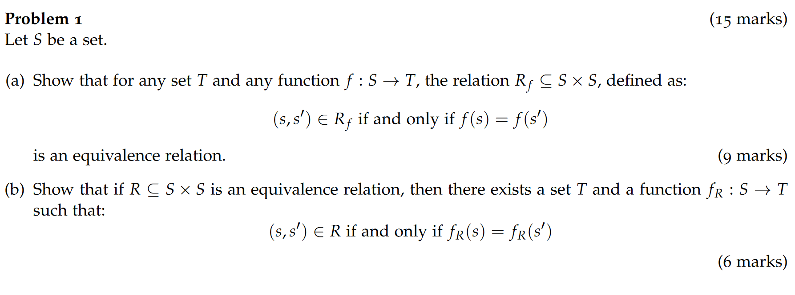

### **(a)**

Reflexivity:
$$
\forall x\in S:f(x)=f(x)\ ,\\
(x,x)\in R{_f}
$$
Symmetry:
$$
\forall x,y\ \ that\ \ (x,y)\in R{_f}:f(x)=f(y),\\
f(y)=f(x),\\
(y,x)\in R{_f}
$$
Transitivity:
$$
\forall x,y,z\ \ that\ \ (x,y)\in R{_f}\ \ and\ \ (y,z)\in R{_f}:\\
f(x)=f(y)=f(z),\\
(x,z)\in R{_f}
$$
Therefore, $R{_f}$ is an equivalence relation.

### **(b)**

Assume that there exists a set $T$ and a function $f{_R}:S\rightarrow T$​ such that:
$$
(s,s')\in R\ \ if\ and\ only\ if\ \ f{_R}(s)=f{_R}(s')
$$
in which $R\subseteq S \times S$ is an equivalence relation.

Then, $(s,f{_R}(s))\in f{_R}$ and $(s',f{_R}(s'))\in f{_R}$.

According to Reflexivity:
$$
\exist s'=s\ \ such\ that\ (s,s')\in R
$$
Then, $(s,f{_R}(s))\in f{_R}$ and $(s,f{_R}(s'))\in f{_R}$.

Since $f{_R}(s)=f{_R}(s')$, satisfy (Fun) and (Tot) in definition of function.

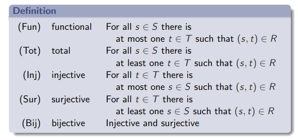

Therefore, function $f{_R}$ exists.

## Problem 2

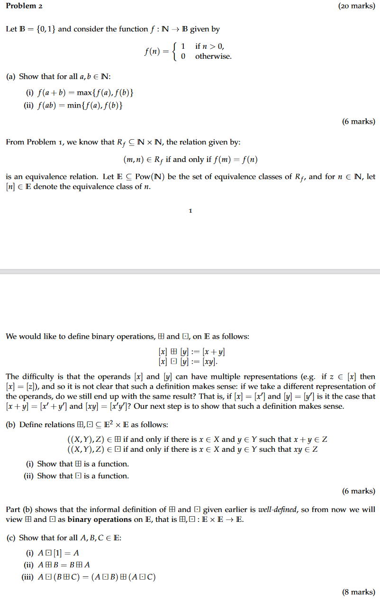

### **(a)**

#### (i)

Domain of $f(n)$ is partitioned by $n=0$ or $n>0$.

Categorized discussion:

1. If $a+b=0$ which stands for $a=b=0$:
   $$
   f(a+b)=f(0)=0=max\{0,0\}=max\{f(0),f(0)\}=max\{f(a),f(b)\}
   $$

2. If $a+b>0$ in which $b=0$ and $a>0$:
   $$
   f(a+b)=1=max\{1,0\}=max\{f(a),f(b)\}
   $$

3. If $a+b>0$ in which $a=0$ and $b>0$, the same as above.

4. If $a+b>0$​ in which $a>0$​ and $b>0$:
   $$
   f(a+b)=1=max\{1,1\}=max\{f(a),f(b)\}
   $$
   

Therefore, $f(a+b)=max\{f(a),f(b)\}$.

#### (ii)

Categorized discussion:

1. If $ab=0$ in which $a=0$ and $b=0$:
   $$
   f(a+b)=0=min\{0,0\}=min\{f(a),f(b)\}
   $$

2. If $ab=0$ in which $a=0$ and $b>0$:
   $$
   f(a+b)=0=min\{0,1\}=min\{f(a),f(b)\}
   $$

3. If $ab=0$ in which $b=0$ and $a>0$, the same as above.

4. If $ab>0$ which stands for $a>0$ and $b>0$:
   $$
   f(a+b)=1=min\{1,1\}=min\{f(a),f(b)\}
   $$

### **(b)**

#### (i)

Let $X,Y,Z$ be one of the elements in $\boxplus$, that is $[X]\boxplus [Y]:=[X+Y]=[Z]$.

Let $X',Y',Z'$ be one of the elements in $\boxplus$, in which $[X']=[X],[Y']=[Y]$ and $[X']\boxplus [Y']:=[X'+Y']=[Z']$.

From the question, define $x\in X$ and $y\in Y$ such that $x+y\in Z$.

Since $[X']=[X],[Y']=[Y]$, apparently, $x\in X'$ and $y\in Y'$ such that $x+y\in Z'$ too.

Therefore, $[Z]=[X+Y]=[X'+Y']=[Z']$. It satisfies (Fun) and (Tot) which are the definition of a function.

Therefore, $\boxplus$ is a function.

#### (ii)

Let $X,Y,Z$ be one of the elements in $\boxdot$, that is $[X]\boxdot [Y]:=[XY]=[Z]$.

Let $X',Y',Z'$ be one of the elements in $\boxdot$, in which $[X']=[X],[Y']=[Y]$ and $[X']\boxdot [Y']:=[X'Y']=[Z']$.

From the question, define $x\in X$ and $y\in Y$ such that $xy\in Z$.

Since $[X']=[X],[Y']=[Y]$, apparently, $x\in X'$ and $y\in Y'$ such that $xy\in Z'$ too.

Therefore, $[Z]=[XY]=[X'Y']=[Z']$. It satisfies (Fun) and (Tot) which are the definition of a function.

Therefore, $\boxdot$ is a function.

### **(c)**

#### (i)

$$
Let\ A=[n]\in E,\\
A\boxdot[1]=[n]\boxdot[1]=[n]=A
$$

#### (ii)

$$
Let\ A=[n{_1}]\in E,\ B=[n{_2}]\in E,\\
A\boxplus B=[n{_1}]\boxplus[n{_2}]=[n{_1}+n{_2}]=[n{_2}+n{_1}]=[n{_2}]\boxplus[n{_1}]=B\boxplus A
$$

#### (iii)

$$
Let\ A=[a]\in E,\ B=[b]\in E,\ C=[c]\in E,\\
A\boxdot(B\boxplus C)=[a]\boxdot([b]\boxplus[c])=[a]\boxdot[b+c]=[a(b+c)]\\
=[ab+ac]=[(ab)+(ac)]=([a]\boxdot[b])\boxplus([a]\boxdot[c])\\=
(A\boxdot B)\boxplus(A\boxdot C)
$$

## Problem 3

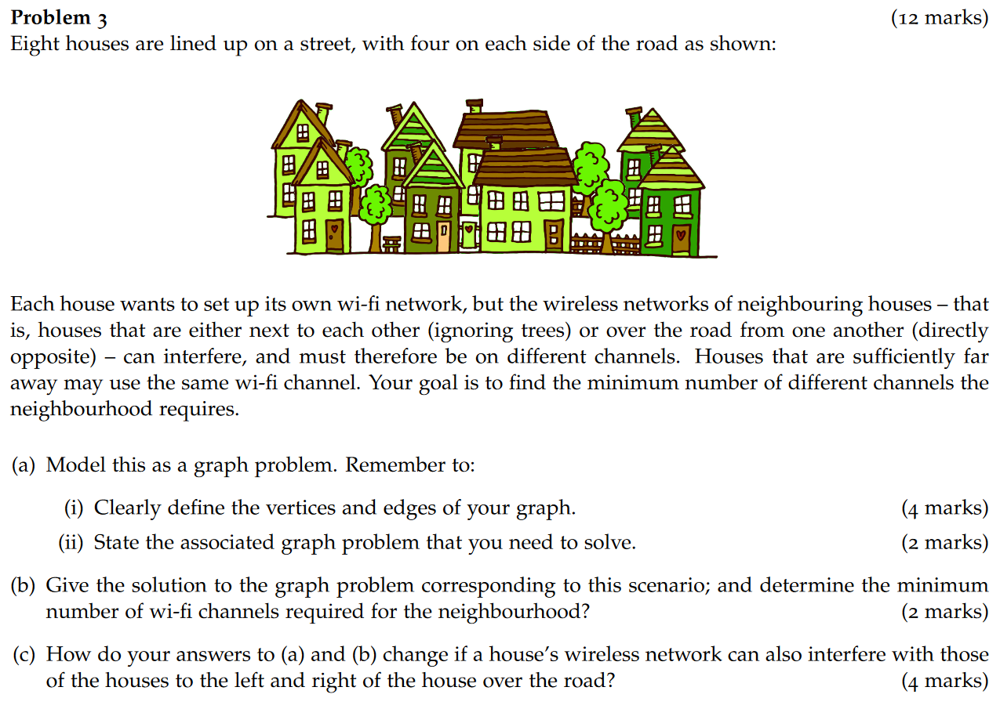

### **(a)**

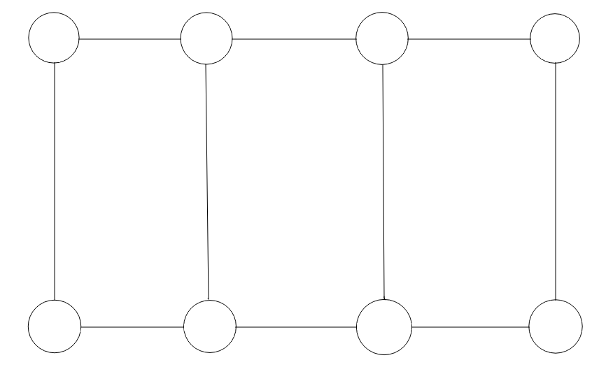

#### (i)

Vertex: Houses

Edge: Neighboring relation among houses

#### (ii)

Problem: Find the chromatic number of this graph

### **(b)**

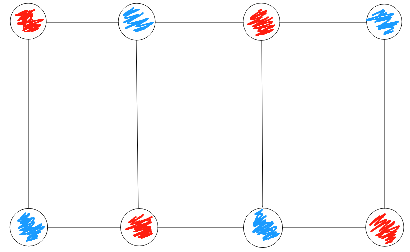

Minimum number: 2

### **(c)**

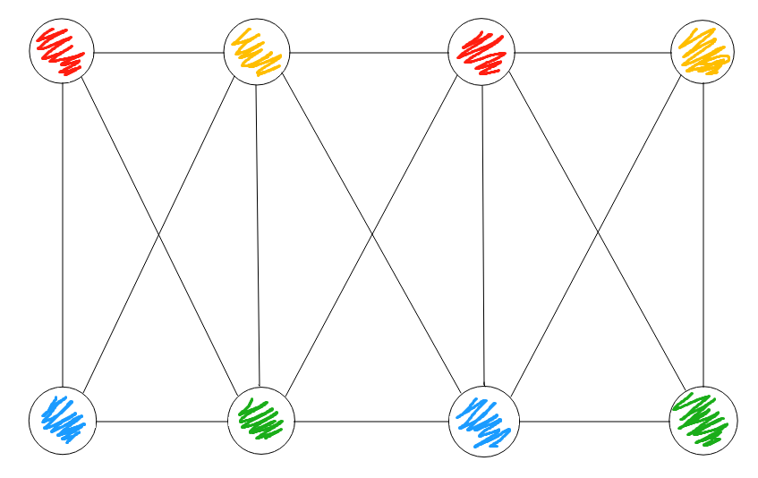

Definition of the graph stays the same while more edges added.

The minimum number becomes 4.

## Problem 4

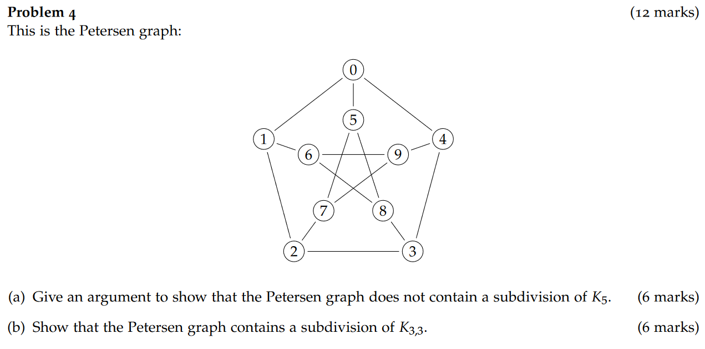

### **(a)**

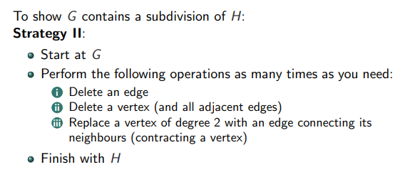

From the definition above, to show $G$ contains a subdivision of $H$ needs to perform the three steps several times.

However, all of the steps either decreases the adjacent edges of certain vertex, or remains the same number of adjacent edges of this vertex.

As shown below, Graph $K{_5}$ contains 5 vertexes each of which possesses a degree of 4.

While in the Petersen graph, each vertex only possesses a degree of 3.

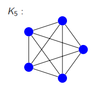

### **(b)**

1. Delete Vertex 0:

   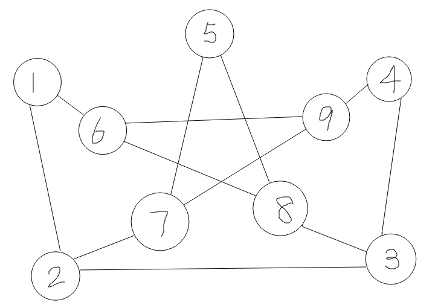

2. Replace Vertex 5:

   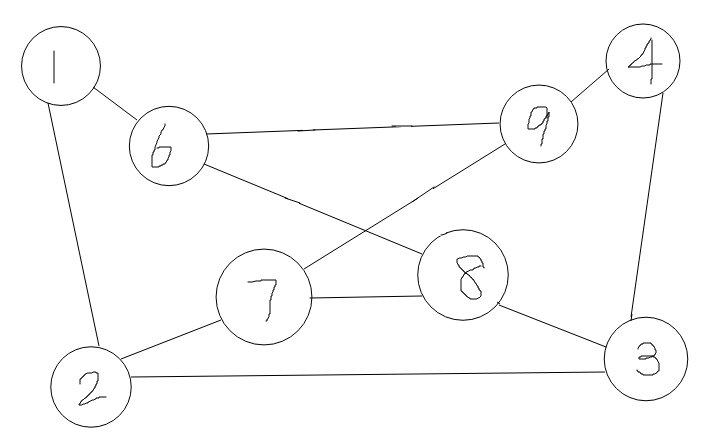

3. Replace Vertex 1 and 4:

   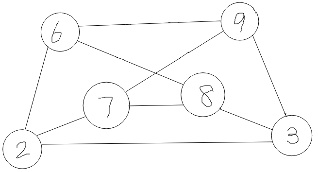

4. Put Vertex 2 to the right side while Vertex 3 to the left side:

   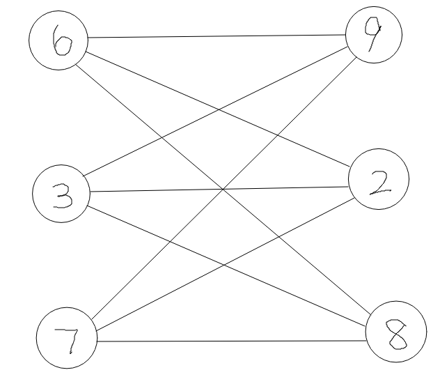

This is exactly what $K{_3}{_,}{_3}$ looks like.

Therefore, the Petersen graph contains a subdivision of $K{_3}{_,}{_3}$.

## Problem 5

### **(a)**

Let $P{_i}(j)$ be the proposition that $R{^i}\subseteq R{^j}$.

$[B]$: when $j=i$, $R{^i}=R{^j}\subseteq R{^j}$,

$[I]$: when $j>i$, if $R{^i}\subseteq R{^j}$, then $R{^i}\subseteq R{^j}\subseteq R{^j}\ \cup (R;R{^j})=R{^j}{^+}{^1}$.

Therefore, $P{_i}(j)$ holds for all $j\ge i$.

Therefore, $\forall i,j\in N$, if $i\le j$ then $R{^i}\subseteq R{^j}$.

### **(b)**

Above is the results from Assignment 1.

Let $P(n)$ be the proposition that $\forall m\in N:R{^n};R{^m}=R{^n}{^+}{^m}$.

$[B]$: when $n=0$, $R{^0};R{^m}=I;R{^m}=R{^m}$.

$[I]$: when $n>0$, if $R{^n};R{^m}=R{^n}{^+}{^m}$​, then:
$$
R{^n}{^+}{^1};R{^m}=(R{^n}\cup(R;R{^n}));R{^m}=(R{^n};R{^m})\cup((R;R{^n});R{^m})\\
=R{^n}{^+}{^m}\cup(R;(R{^n};R{^m}))\\
=R{^n}{^+}{^m}\cup(R;(R{^n}{^+}{^m}))\\
=R{^n}{^+}{^m}{^+}{^1}
$$
Therefore, $P(n)$ holds for all $n\in N$.

### **(c)**

If there exists $i\in N$ such that $R{^i}=R{^i}{^+}{^1}$,

Let $P(j)$ be the proposition that $\forall j\ge i:R{^j}=R{^i}$.

$[B]$: when $j=i$, $R{^j}=R{^i}$.

$[I]$: when $j>i$, if $R{^j}=R{^i}$​, then:
$$
R{^j}{^+}{^1}=R{^j}\cup(R;R{^j})=R{^i}\cup(R;R{^i})=R{^i}{^+}{^1}=R{^i}
$$
Therefore, $P(j)$ holds for all $j\ge i$.

Therefore, if there exists $i\in N$ such that $R{^i}=R{^i}{^+}{^1}$, then $R{^j}=R{^i}$ for all $j\ge i$.

## Problem 6

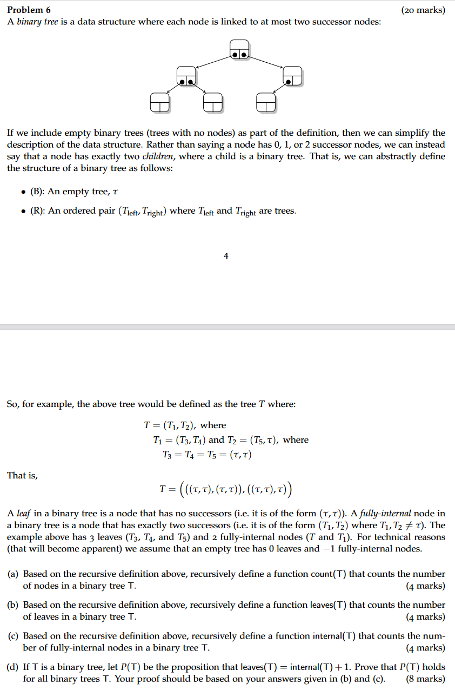

### **(a)**

$$
\begin{align*}
count&(T):\\\\
&(B)\ if\ (T=\tau):0\\\\
&(R)\ else:\ 1+count(T{_l}{_e}{_f}{_t})+count(T{_r}{_i}{_g}{_h}{_t})
\end{align*}
$$

### **(b)**

$$
\begin{align*}
leaves(T)&:\\\\
(B)&\ if\ (T=\tau):0\\\\
(R)&\ if\ (T{_l}{_e}{_f}{_t}=T{_r}{_i}{_g}{_h}{_t}=\tau):1\\\\
&else:\ leaves(T{_l}{_e}{_f}{_t})+leaves(T{_r}{_i}{_g}{_h}{_t})
\end{align*}
$$

### **(c)**

$$
\begin{align*}
internal(T)&:\\\\
(B)&\ if\ (T=\tau):-1\\\\
(R)&\ if\ (T{_l}{_e}{_f}{_t}\neq\tau\ \ and\ \ T{_r}{_i}{_g}{_h}{_t}\neq\tau):1+internal(T{_l}{_e}{_f}{_t})+internal(T{_r}{_i}{_g}{_h}{_t})\\\\
&if\ (T{_l}{_e}{_f}{_t}=T{_r}{_i}{_g}{_h}{_t}=\tau):0\\\\
&if\ (T{_l}{_e}{_f}{_t}=\tau):internal(T{_r}{_i}{_g}{_h}{_t})\\\\
&if\ (T{_r}{_i}{_g}{_h}{_t}=\tau):internal(T{_l}{_e}{_f}{_t})
\end{align*}
$$

