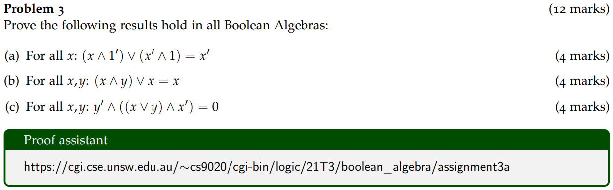

# Assignment 3

Sixiang Qiu

November 2021

## Problem 1

### (a)

Given that two matrices are both $n \times n$, and adding elements take $O(1)$ time,

In the inner loop of  $sum(A,B)$, each loop takes $O(1)$ time.

Then, the inner loop can be carried out in $O(n)$ time.

For the whole function which is the inner loop nested with an outer one, it can be carried out in $O(n^2)$ time.

Therefore, the asymptotic upper bound for the running time of sum is $O(n^2)$.

### (b)

Given that two matrices are both $n \times n$, and multiplying elements take $O(1)$ time,

$A[i,k]*B[k,j]$ for $k \in [0,n)$ can be carried out in $O(1)$ time.

'Add' instruction adds all elements in the set above which is of size $n$.

The time complexity for 'add' instruction in function $product(A,B)$ is $O(n)$.

Same as question(a), 'add' instruction is also nested with two for loops.

Each of them runs for $n$ times.

Therefore, the asymptotic upper bound for the running time of product is $O(n^3)$.

### (c)

In the above figure, it is easy to count that, in each recursion,

8 multiplications are done for matrices which are of size $\frac{n}{2} \times \frac{n}{2}$ and 4 additions as well.

The time complexity analysis for multiplication is passed to the next recursion.

While, addition of two takes $O(n^2)$ time, given in question(a).

Therefore, the recurrence equation for $T(n)$​ is defined below:
$$
T(n)=8\cdot T(\frac{n}{2})\ +\ O(n^2)
$$

### (d)

From the definition of Master Theorem, for recurrence equation in question(c):
$$
a=8\\
b=2\\
c=2\\
k=0
$$
Which is Case 1, $T(n)=\Theta(n^3)$,

Therefore, the asymptotic upper bound for $T(n)$ is $O(n^3)$.

## Problem 2

### (a)

#### (i)

Mark the 8 houses by 8 characters as below:

Each character represent 'House X uses channel 1'.

True means it is using channel 1 while false means it is using channel 2.

#### (ii)

Then the constraints, in this problem interference, are:
$$
p\equiv A\rightarrow (\neg B\ \wedge \neg E)
$$

$$
q\equiv B\rightarrow ((\neg A\ \wedge \neg C)\ \wedge \neg F)
$$

$$
r\equiv C\rightarrow ((\neg B\ \wedge \neg D)\ \wedge \neg G)
$$

$$
s\equiv D\rightarrow (\neg C\ \wedge \neg H)
$$

$$
t\equiv E\rightarrow (\neg A\ \wedge \neg F)
$$

$$
u\equiv F\rightarrow ((\neg B\ \wedge \neg E)\ \wedge \neg G)
$$

$$
v\equiv G\rightarrow ((\neg C\ \wedge \neg F)\ \wedge \neg H)
$$

$$
w\equiv H\rightarrow (\neg D\ \wedge \neg G)
$$

#### (iii)

To solve the problem, define $\phi$​ as below:
$$
\phi \equiv p\ \wedge q\ \wedge r\ \wedge s\ \wedge t\ \wedge u\ \wedge v
\ \wedge w
$$
If $\phi$ is satisfiable, then the problem is solved. Otherwise, it cannot be done.

To list a truth table of $A,B,C,D,E,F,G,H$ and their constraints,

Omit those which turn their constraints to be all false.

That would also brings a satisfying result of $\phi$, but it is not the problem asking for.

#### (iv)

Since problem changed from solving with 3 channels rather than 2,

It becomes insufficient if only declaring $A,B,C,D,E,F,G,H$.

Each of them can be expanded to the form of $A{_1},A{_2},A{_3}$,

Which represents 'House A is using channel 1 (2, 3)'.

Constraints should also time 3:
$$
A_1\rightarrow (\neg B_1\ \wedge \neg E_1)
$$

$$
A_2\rightarrow (\neg B_2\ \wedge \neg E_2)
$$

$$
A_3\rightarrow (\neg B_3\ \wedge \neg E_3)
$$

Similarly,
$$
\phi_1 \equiv p_1\ \wedge q_1\ \wedge r_1\ \wedge s_1\ \wedge t_1\ \wedge u_1\ \wedge v_1
\ \wedge w_1
$$

$$
\phi_2 \equiv p_2\ \wedge q_2\ \wedge r_2\ \wedge s_2\ \wedge t_2\ \wedge u_2\ \wedge v_2
\ \wedge w_2
$$

$$
\phi_3 \equiv p_3\ \wedge q_3\ \wedge r_3\ \wedge s_3\ \wedge t_3\ \wedge u_3\ \wedge v_3
\ \wedge w_3
$$

The problem becomes to find truth values which make these three true.

### (b)

All possible situation is $2^8=256$.

The situation with no interference is $2$.

Therefore, the probability is $\frac{1}{128}$.

## Problem 3

### (a)

$$
\begin{array}{rclr}
    (x \wedge  1 ' ) \vee  (x'  \wedge  1 )&=& ((x \wedge  1 ' ) \vee  x' ) \wedge  ((x \wedge  1 ' ) \vee  1 ) &\quad\text{(Distributivity of $\vee$ over $\wedge$)}\\
    &=& (x'  \vee  (x \wedge  1 ' )) \wedge  ((x \wedge  1 ' ) \vee  1 ) &\quad\text{(Commutatitivity of $\vee$)}\\
    &=& (x'  \vee  (x \wedge  1 ' )) \wedge  (1  \vee  (x \wedge  1 ' )) &\quad\text{(Commutatitivity of $\vee$)}\\
    &=& ((x'  \vee  x) \wedge  (x'  \vee  1 ' )) \wedge  (1  \vee  (x \wedge  1 ' )) &\quad\text{(Distributivity of $\vee$ over $\wedge$)}\\
    &=& ((x'  \vee  x) \wedge  (x'  \vee  1 ' )) \wedge  ((1  \vee  x) \wedge  (1  \vee  1 ' )) &\quad\text{(Distributivity of $\vee$ over $\wedge$)}\\
    &=& ((x \vee  x' ) \wedge  (x'  \vee  1 ' )) \wedge  ((1  \vee  x) \wedge  (1  \vee  1 ' )) &\quad\text{(Commutatitivity of $\vee$)}\\
    &=& (1  \wedge  (x'  \vee  1 ' )) \wedge  ((1  \vee  x) \wedge  (1  \vee  1 ' )) &\quad\text{(Complement with $\vee$)}\\
    &=& (1  \wedge  (x'  \vee  1 ' )) \wedge  ((1  \vee  x) \wedge  1 ) &\quad\text{(Complement with $\vee$)}\\
    &=& ((x'  \vee  1 ' ) \wedge  1 ) \wedge  ((1  \vee  x) \wedge  1 ) &\quad\text{(Commutatitivity of $\wedge$)}\\
    &=& (x'  \vee  1 ' ) \wedge  ((1  \vee  x) \wedge  1 ) &\quad\text{(Identity of $\wedge$)}\\
    &=& (x'  \vee  1 ' ) \wedge  (1  \vee  x) &\quad\text{(Identity of $\wedge$)}\\
    &=& (x \wedge  1 )'  \wedge  (1  \vee  x) &\quad\text{(De Morgan$'$s, $'$ over $\wedge$)}\\
    &=& x'  \wedge  (1  \vee  x) &\quad\text{(Identity of $\wedge$)}\\
    &=& x'  \wedge  (x \vee  1 ) &\quad\text{(Commutatitivity of $\vee$)}\\
    &=& x'  \wedge  1  &\quad\text{(Annihilation of $\vee$)}\\
    &=& x'  &\quad\text{(Identity of $\wedge$)}
\end{array}
$$

### (b)

$$
\begin{array}{rclr}
    (x \wedge  y) \vee  x&=& (x \wedge  y) \vee  (x \wedge  1 ) &\quad\text{(Identity of $\wedge$)}\\
    &=& (x \wedge  1 ) \vee  (x \wedge  y) &\quad\text{(Commutatitivity of $\vee$)}\\
    &=& x \wedge  (1  \vee  y) &\quad\text{(Distributivity of $\wedge$ over $\vee$)}\\
    &=& x \wedge  (y \vee  1 ) &\quad\text{(Commutatitivity of $\vee$)}\\
    &=& x \wedge  1  &\quad\text{(Annihilation of $\vee$)}\\
    &=& x &\quad\text{(Identity of $\wedge$)}
\end{array}
$$

### (c)

$$
\begin{array}{rclr}
    y'  \wedge  ((x \vee  y) \wedge  x' )&=& ((x \vee  y) \wedge  x' ) \wedge  y'  &\quad\text{(Commutatitivity of $\wedge$)}\\
    &=& (x \vee  y) \wedge  (x'  \wedge  y' ) &\quad\text{(Associativity of $\wedge$)}\\
    &=& (x \vee  y) \wedge  (x \vee  y)'  &\quad\text{(De Morgan$'$s, $'$ over $\vee$)}\\
    &=& 0  &\quad\text{(Complement with $\wedge$)}
\end{array}
$$

## Problem 4

Let a Boolean Algebra be $(T,\ \vee,\ \wedge,\ ',\ \mathbb{0},\ \mathbb{1})$ where $T=\{\mathbb{0},\mathbb{1}\}$

From the definition of complementation:
$$
\mathbb{0}'=\mathbb{1}\\
\mathbb{1}'=\mathbb{0}
$$
Now, add a third element $x$ to this structure, where $x$ is distinct from $\mathbb{0}$ and $\mathbb{1}$.

To meet complementation requirement, $x'$ should also in $T$.

1. If $x'=\mathbb{0}$, then $x=\mathbb{1}$, $x$ is not distinct.
2. if $x'=\mathbb{1}$, then $x=\mathbb{0}$, $x$ is not distinct.
3. if $x'=x$, then $x\vee x'=x$, complementation not holds.

It is either not a Boolean Algebra or another new element should be added.

Therefore, there are no three element Boolean Algebras.

## Problem 5

### (a)

Left side of the equation can be changed to the form as below:
$$
\begin{array}{rclr}
    \neg(p\rightarrow q)
    &\equiv&\neg(\neg p\vee q)
    &\quad\text{(Implication)}\\
    &\equiv&\neg\neg p\wedge\neg q
    &\quad\text{(De Morgan's, $\neg$ over $\vee$)}\\
    &\equiv&p\wedge\neg q
    &\quad\text{(Double negation)}
\end{array}
$$
Right side of the equation can be changed to the form as below:
$$
\begin{array}{rclr}
    (\neg p\rightarrow\neg q)
    &\equiv&p\vee\neg q
    &\quad\text{(Implication)}
\end{array}
$$
Equation(22) is equivalent to equation(23) if and only if $p\equiv q$​, that is:
$$
p\wedge\neg q\equiv p\equiv q\equiv p\vee\neg q
$$
Therefore, question(a) disproved.

### (b)

$$
\begin{array}{rclr}
    ((p\wedge q) \rightarrow  r)&\equiv& \neg (p \wedge  q) \vee  r &\quad\text{(Implication)}\\
    &\equiv& (\neg p \vee  \neg q) \vee  r &\quad\text{(De Morgan's, $\neg$ over $\wedge$)}\\
    &\equiv& \neg p \vee  (\neg q \vee  r) &\quad\text{(Associativity of $\vee$)}\\
    &\equiv& p \rightarrow  (\neg q \vee  r) &\quad\text{(Implication)}\\
    &\equiv& (p \rightarrow  (q\rightarrow r)) &\quad\text{(Implication)}
\end{array}
$$

### (c)

$$
\begin{array}{rclr}
    ((p \vee  (q\vee r)) \wedge  (r\vee p))&\equiv& ((p \vee  q) \vee  r) \wedge  (r \vee  p) &\quad\text{(Associativity of $\vee$)}\\
    &\equiv& (r \vee  (p \vee  q)) \wedge  (r \vee  p) &\quad\text{(Commutatitivity of $\vee$)}\\
    &\equiv& r \vee  ((p \vee  q) \wedge  p) &\quad\text{(Distributivity of $\vee$ over $\wedge$)}\\
    &\equiv& r \vee  (p \wedge  (p \vee  q)) &\quad\text{(Commutatitivity of $\wedge$)}\\
    &\equiv& r \vee  ((p \vee  p) \wedge  (p \vee  q)) &\quad\text{(Idempotence of $\vee$)}\\
    &\equiv& r \vee  (p \vee  (p \wedge  q)) &\quad\text{(Distributivity of $\vee$ over $\wedge$)}\\
    &\equiv& (r \vee  p) \vee  (p \wedge  q) &\quad\text{(Associativity of $\vee$)}\\
    &\equiv& ((p\wedge q) \vee  (r\vee p)) &\quad\text{(Commutatitivity of $\vee$)}
\end{array}
$$

## Problem 6

### (a)

The recursive definition of a binary tree structure shows that,

To count the number of nodes of a binary tree, it is to add up the number of nodes in its left tree and right tree.

Reversely, to depict a binary tree with $n$ nodes, after fixing its root node,

There lefts $n-1$ nodes to be distributed.

For $n=3$, there are two nodes regardless of the root, to distribute these two nodes,

Either put them to the left tree or right tree. Otherwise, one in left tree and one in right tree, that is:
$$
T(3)=T(2)T(0)+T(1)T(1)+T(0)T(2)
$$
For $n$​, this function can be written in the form as below:
$$
T(n)=T(n-1)T(0)+T(n-2)T(1)+...+T(1)T(n-2)+T(0)T(n-1)
$$
Therefore, the recurrence equation for T(n) is:
$$
T(0)=1
$$

$$
\begin{array}{rclr}
T(n)=\sum_{k=0}^{n-1}\ T(k)T(n-k-1)&\quad (n\geq1)
\end{array}
$$

### (b)

The nodes in a full binary tree is either a fully-internal node or a leaf.

From the observation from Assignment 2, number of leaves equals to number of internal nodes plus one.

Therefore, number of nodes in a full binary tree can be expressed as below:
$$
\begin{array}{rclr}
\text{count}(n)&=&\text{internal}(n)+\text{leaves}(n)&\\
&=&\text{internal}(n)+\text{internal}(n)+1\\
&=&2\cdot\text{internal}(n)+1
\end{array}
$$
Therefore, a full binary tree must have an odd number of nodes.

### (c)

Let $n'$ represent the number of internal nodes in a full binary tree with number of nodes $n$.

Then, there are $T(n')$ ways to form a tree with these internal nodes alone.

Meanwhile, for each way, there is exactly one corresponding way to insert the leaf nodes so that the whole binary tree remains a full one.

Therefore,
$$
B(n)=T(n')
$$
From equation(31) that:
$$
n=2\cdot n'+1
$$
Therefore,
$$
B(n)=T(\frac{n-1}{2})
$$
